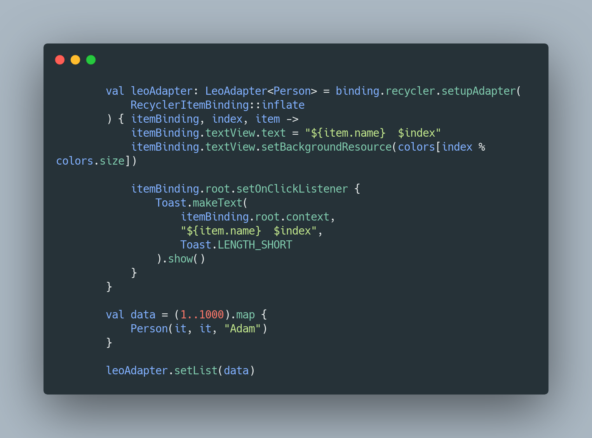

# LeoAdapter
[](https://search.maven.org/search?q=g:%com.adkhambek.leo)

```gradle
allprojects {
    repositories {
        ...
        mavenCentral()
    }
}
```

```grad
dependencies {
    implementation 'com.adkhambek.leo:leo:$lastVersion'
}
```

```kotlin
    val leoAdapter: LeoAdapter<Person> = binding.recycler.setupAdapter(
        RecyclerItemBinding::inflate
    ) { itemBinding, index, item ->
        itemBinding.textView.text = "${item.name}  $index"
        itemBinding.textView.setBackgroundResource(colors[index % colors.size])

        itemBinding.root.setOnClickListener {
            Toast.makeText(itemBinding.root.context, "${item.name}  $index", Toast.LENGTH_SHORT).show()
        }
    }

    val data = (1..1000).map {
        Person(it, it, "Adam")
    }

    leoAdapter.setList(data)
```


```kotlin
    val leoAdapter: LeoAdapter<Person> = binding.viewPager2.setupAdapter(
        RecyclerItemBinding::inflate
    ) { itemBinding, index, item ->
        itemBinding.textView.text = "${item.name}  $index"
        itemBinding.textView.setBackgroundResource(colors[index % colors.size])

        itemBinding.root.setOnClickListener {
            Toast.makeText(itemBinding.root.context, "${item.name}  $index", Toast.LENGTH_SHORT).show()
        }
    }

    val data = (1..1000).map {
        Person(it, it, "Adam")
    }

    leoAdapter.setList(data)
```


```kotlin
    val leoAdapter: LeoAdapter<Person> = binding.spinner.setupAdapter(
        RecyclerItemBinding::inflate
    ) { itemBinding, index, item ->
        itemBinding.textView.text = "${item.name}  $index"
        itemBinding.textView.setBackgroundResource(colors[index % colors.size])

        itemBinding.root.setOnClickListener {
            Toast.makeText(itemBinding.root.context, "${item.name}  $index", Toast.LENGTH_SHORT).show()
        }
    }

    val data = (1..1000).map {
        Person(it, it, "Adam")
    }

    leoAdapter.setList(data)
```

```kotlin
data class Person(
    val id: Int,
    val age: Int,
    val name: String
)
```


