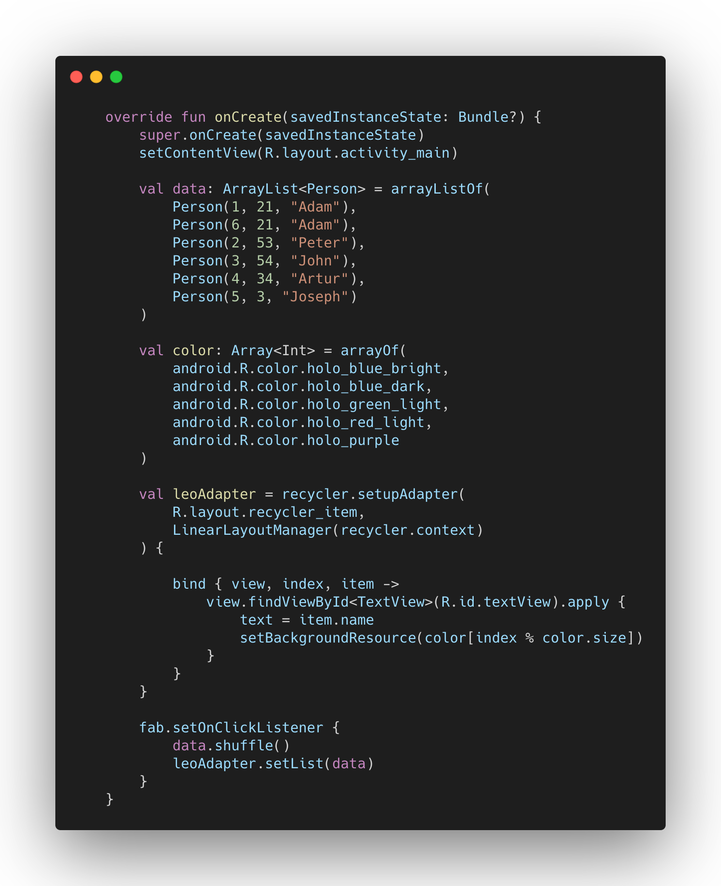

# LeoAdapter
[](https://jitpack.io/#MrAdkhambek/LeoAdapter)


```gradle
allprojects {
		repositories {
			...
			maven { url 'https://jitpack.io' }
		}
}
```

```grad
dependencies {
    implementation 'com.github.MrAdkhambek:LeoAdapter:0.2.3'
}
```

```kotlin
val leoAdapter = recycler.setupAdapter(
        R.layout.recycler_item
    ) {
        bind { view, index, item ->
            view.findViewById<TextView>(R.id.textView).apply {
                text = item.name
                setBackgroundResource(color[index % color.size])
            }
        }
}
```

```kotlin
val leoAdapter = recycler.setupAdapter(
        R.layout.recycler_item,
        LinearLayoutManager(recycler.context)
    ) {
        bind { view, index, item ->
            view.findViewById<TextView>(R.id.textView).apply {
                text = item.name
                setBackgroundResource(color[index % color.size])
            }
        }
}
```


```kotlin
val leoAdapter = recycler.setupAdapter(
        R.layout.recycler_item,
        DIFF_ITEM_CALLBACK,
        LinearLayoutManager(recycler.context)
    ) {
        bind { view, index, item ->
            view.findViewById<TextView>(R.id.textView).apply {
                text = item.name
                setBackgroundResource(color[index % color.size])
            }
        }
}
```

# We now support spinnerView and ViewPager2

```kotlin
val leoAdapter = spinnerView.setupAdapter(
        R.layout.recycler_item
    ) {
        bind { view, index, item ->
            view.findViewById<TextView>(R.id.textView).apply {
                text = item.name
                setBackgroundResource(color[index % color.size])
            }
        }
}
```

```kotlin
val leoAdapter = viewPager2.setupAdapter(
        R.layout.recycler_item
    ) {
        bind { view, index, item ->
            view.findViewById<TextView>(R.id.textView).text = item.name
            view.setBackgroundResource(color[index % color.size])
        }
}
```


